* [環境構築編](https://tuatmcc.com/blog/UnityLec2024Step0/)
* [入門編](https://tuatmcc.com/blog/UnityLec2024Step1/)
* [応用編](https://tuatmcc.com/blog/UnityLec2024Step2/)
* 発展編 ← 今ここ

# 1. はじめに

* この記事は Unity 講習会 2024 発展編の資料です
* Unity Hub と Unity 2022.3.38f1 をインストール済み(※ 2022.3.38f1 はあくまで例)
* 任意の IDE がある(Visual studio, Rider など)
* Unity ちょっと触ったことがある人

## 1.1. 題材

Unityちゃんアドベンチャーゲーム

## 1.2. 学ぶこと

* Decal
* Zenject
* UniTask, R3
* DoTween

# 2. Unity ちゃんにアニメーションを追加する

ここでは Unity ちゃんにジャンプのアニメーションを追加します。

## 2.1. ジャンプアニメーションの追加

/Assets/UnityChanAdventure/Animations/ の中にある `UnityChanAnimatorController` に /Assets/UnityChan の中にある `JUMP00B` をドラッグアンドドロップしてください。**`JUMP00` ではなく、`JUMP00B` です！**

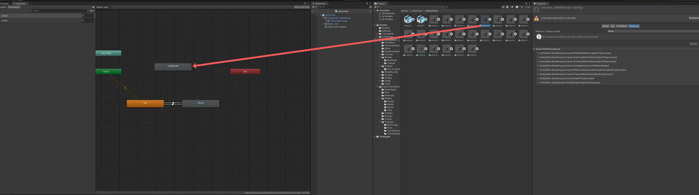

次に、 `+` を押してパラメーターに `jump` を追加してください。種類は `Trigger` です。

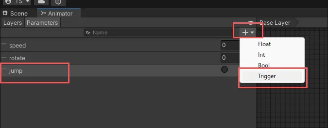

続いて、ジャンプのアニメーションステートに `Move` と `Idle` から遷移する矢印を双方向に追加してください。

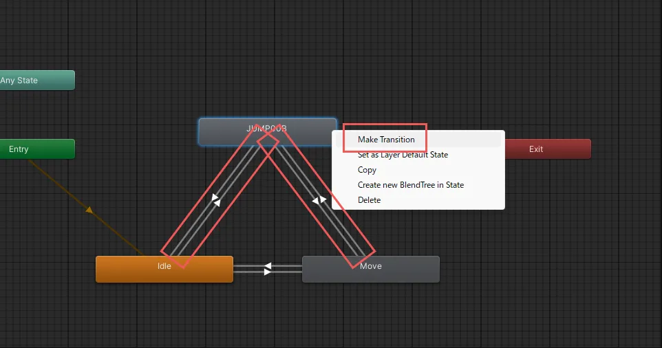

ジャンプのステートに向かう２つの矢印(`Idel -> Jump00B` と `Move -> Jump00`)では、 `Has Exit Time` のチェックを外してください。そして、 `Conditions` に `Jump` を追加してください。

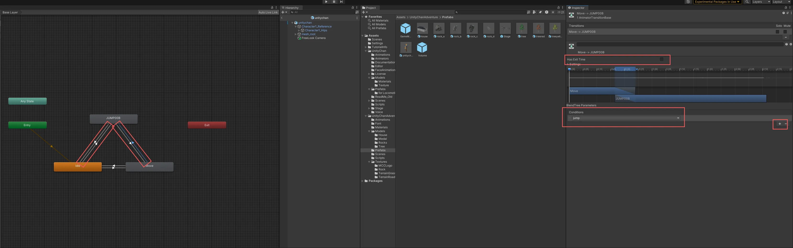

`Jump00B -> Move` への `Conditions` には `speed` で `0.1` 以上を設定してください。

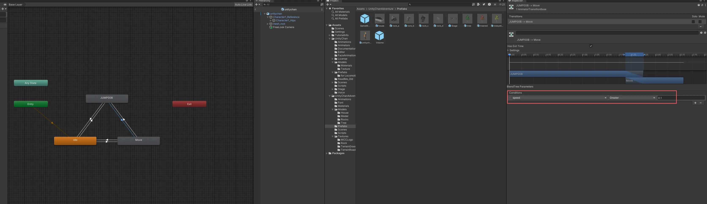

`Jump00B -> Idle` への `Conditions` には `speed` で `0.1` 未満を設定してください。


## 2.2. ジャンプをスペースキーで発動させる

スペースキーを押すとジャンプするようにします。

/Assets/UnitychanAdventure の中にある Input Actions Assets の `Main` に `+` を押して `Jump` を追加してください。キーの内容はスペースキーです。

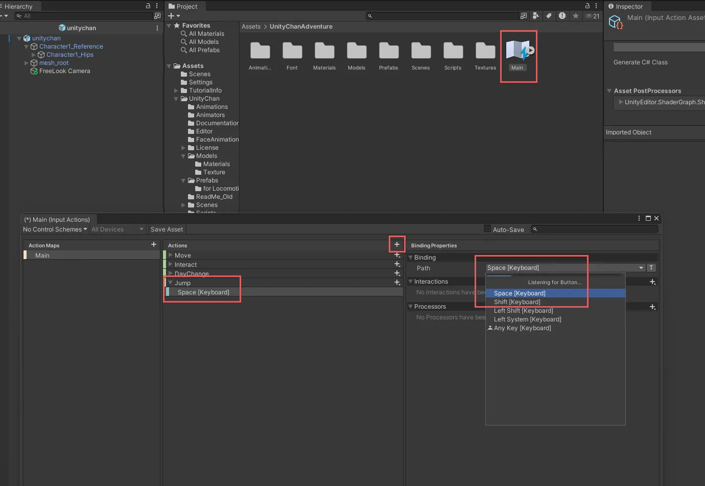

設定できたら、 Input Action Assets の編集ウィンドウの上のほうにある `Save Asset` を押して保存してください。

次に /Assets/UnitychanAdventure/Scripts/UnityChanController.cs の中にある `Update` メソッドに以下のコードを追加してください。

```diff title="UnityChanController.cs"
using System;
using System.Collections;
using System.Collections.Generic;
using UnityEngine;
using UnityEngine.InputSystem;

public class UnityChanController : MonoBehaviour
{
    private Rigidbody rb;
    private float speed;
    private float rotationSpeed;
    private Vector2 moveInput;
    private Animator animator;
    private Interactable interactableObj;

    [SerializeField] private float moveSpeedConst = 5.0f;
    [SerializeField] private float rotationSpeedConst = 5.0f;

    void Start()
    {
        rb = GetComponent<Rigidbody>();
        animator = GetComponent<Animator>();
    }

    void FixedUpdate()
    {
        speed = moveInput.y * moveSpeedConst;
        rotationSpeed = moveInput.x * rotationSpeedConst;

        rb.velocity = transform.forward * speed + new Vector3(0f, rb.velocity.y, 0f);
        rb.angularVelocity = new Vector3(0, rotationSpeed, 0);
    }

    public void OnMove(InputAction.CallbackContext context)
    {
        moveInput = context.ReadValue<Vector2>();
        animator.SetFloat("speed", moveInput.y);
        animator.SetFloat("rotate", moveInput.x);
    }

    private void OnTriggerEnter(Collider other)
    {
        if (other.TryGetComponent<Interactable>(out var obj))
        {
            interactableObj = obj;
        }
    }
    
    private void OnTriggerExit(Collider other)
    {
        if (other.gameObject.TryGetComponent<Interactable>(out var obj) && obj == interactableObj)
        {
            interactableObj = null;
        }
    }

    public void OnInteract(InputAction.CallbackContext context)
    {
        if (context.performed)
        {
            interactableObj?.Interact();
        }
    }

+   public void OnJump(InputAction.CallbackContext context)
+    {
+      if (context.performed)
+       {
+           animator.SetTrigger("jump");
+       }
+   }
}
```

`Main` シーンを開き、Hierarchy にある `GameManeger` の `Player Input` の `Event` -> `Main` の `Jump` で `+` を押し、 `Main` シーンにある `unitychan` をドラッグアンドドロップして、 No Function のところにある `Unity Chan Controller` の `On Jump` を選択してください。

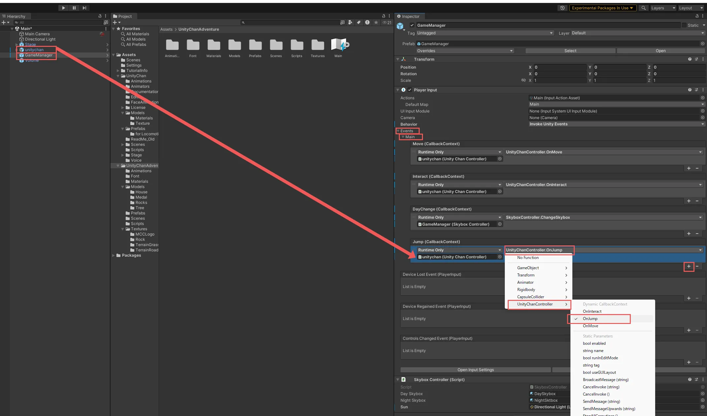

# 2.3. ジャンプの修正

一見問題なくジャンプできそうですが、ジャンプすると両足が揃ってるときに、滑って見えます。また、スペースキーを連打すると、連続でジャンプしてしまいます。


滑って見える問題は、アニメーションの遷移する時間を長くすることで多少解決できます。 UnityChanAnimatorController で、ジャンプのステートと、移動のステートの遷移を開き、タイムバーにある `>|`, `|<` をドラッグして長くしてください。長さはジャンプのアニメーションの半分ぐらいに合わせてください。逆向きの遷移も同様にしてください。

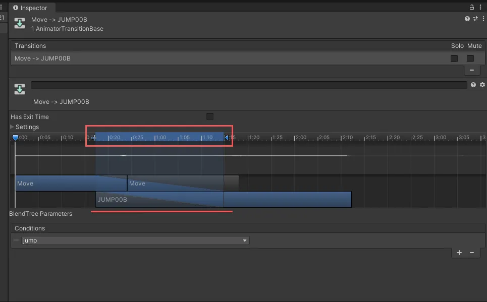

これで、ジャンプのアニメーションが多少滑らかになりました。


連続ジャンプは、地面の接地判定をし、空中にいる間ジャンプを無効化することで解決できます。しかし、現状のUnityちゃんではジャンプしても当たり判定は変わっていません。つまり、見た目はジャンプしても物理演算的には常に地面にいるので、空中判定がとれません。以下では緑の枠が当たり判定で、ジャンプしても、当たり判定が地面にあることがわかります。


ジャンプしたらUnityちゃんに上方向の力を加えます。空中判定は Raycast で行います。Raycast は、指定した方向に線を飛ばし、当たったオブジェクトを取得することができます。

/Assets/UnitychanAdventure/Scripts/UnityChanController.cs に以下のコードを追加してください。

```diff title="UnityChanController.cs"
using System;
using System.Collections;
using System.Collections.Generic;
using UnityEngine;
using UnityEngine.InputSystem;

public class UnityChanController : MonoBehaviour
{
    private Rigidbody rb;
    private float speed;
    private float rotationSpeed;
    private Vector2 moveInput;
    private Animator animator;
    private Interactable interactableObj;
    
    [SerializeField] private float moveSpeedConst = 5.0f;
    [SerializeField] private float rotationSpeedConst = 5.0f;
+   [SerializeField] private float jumpForce = 200.0f;
+   [SerializeField] private float raydistance = 1.1f;

    void Start()
    {
        rb = GetComponent<Rigidbody>();
        animator = GetComponent<Animator>();
    }

    void FixedUpdate()
    {
        speed = moveInput.y * moveSpeedConst;
        rotationSpeed = moveInput.x * rotationSpeedConst;

        rb.velocity = transform.forward * speed + new Vector3(0f, rb.velocity.y, 0f);
        rb.angularVelocity = new Vector3(0, rotationSpeed, 0);
    }

    public void OnMove(InputAction.CallbackContext context)
    {
        moveInput = context.ReadValue<Vector2>();
        animator.SetFloat("speed", moveInput.y);
        animator.SetFloat("rotate", moveInput.x);
    }

    private void OnTriggerEnter(Collider other)
    {
        if (other.TryGetComponent<Interactable>(out var obj))
        {
            interactableObj = obj;
        }
    }

    private void OnTriggerExit(Collider other)
    {
        if (other.gameObject.TryGetComponent<Interactable>(out var obj) && obj == interactableObj)
        {
            interactableObj = null;
        }
    }

    public void OnInteract(InputAction.CallbackContext context)
    {
        if (context.performed)
        {
            interactableObj?.Interact();
        }
    }

    public void OnJump(InputAction.CallbackContext context)
    {
        if (context.performed)
        {
+           bool isGrounded = Physics.Raycast(transform.position + new Vector3(0.0f, 1.0f, 0.0f), Vector3.down, raydistance);
+           if (isGrounded)
+           {
+               animator.SetTrigger("jump");
+               rb.AddForce(Vector3.up * jumpForce);
+           }
        }
    }
}
```

これで、ジャンプしても空中にいるかどうかが判定され、空中にいる場合はジャンプできなくなります。また、ジャンプ時に上方向に力が加わるので、ジャンプで当たり判定も変わります。


# 3. Decal

Decal はプロジェクターで投影するように、任意の画像や動画を投影するものです。ここでは Unity 標準の Decal を使って、 MCC のロゴを投影します。

## 3.1. Decal の追加

/UnityChanAdventure/Prefabs/ の中に `MccLogoProjector` プレハブを作成してください。その後、 `MccLogoProjector` に `URP Decal Projector` コンポーネントを追加してください。

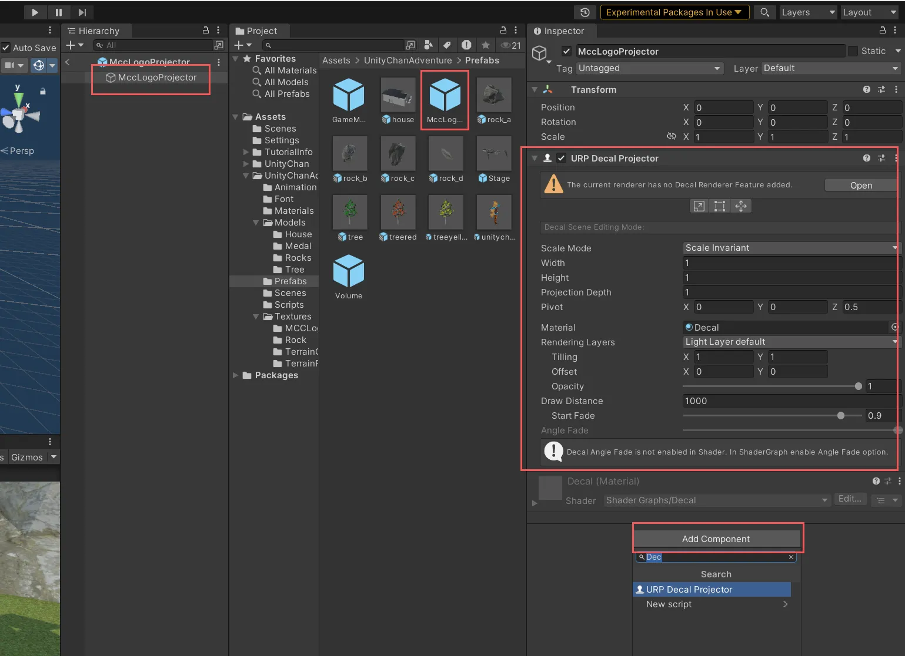

`URP Decal Projector` コンポーネントに "The current renderer has no Decal Renderer Feature added." という警告が出てきます。その隣の `Open` をクリックし、Universal Render Data を開き、`Add Renderer Feature` をクリックして、 `Decal` を追加してください。

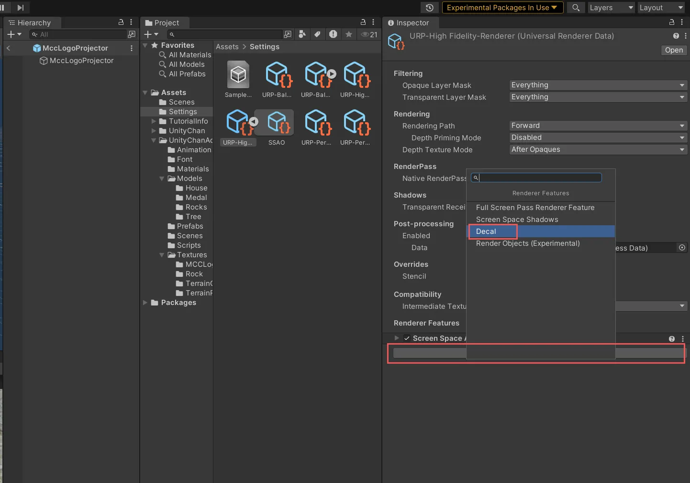

これで `MccLogoProjector` に警告が出なくなります。

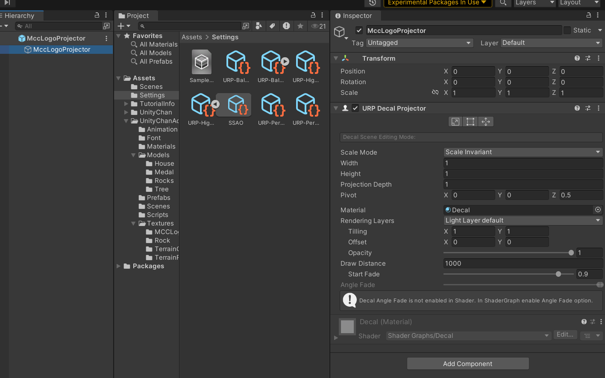

## 3.2. Decal マテリアルの作成

Decal のマテリアルを作るために、 Decal のシェーダーを作ります。

/Assets/UnityChanAdventure で右クリックし、 `Shaders` フォルダーを作り、 `Shaders` フォルダーの中で右クリックし。 Create -> Shader Graph -> URP -> Decal Shader Graph を選択して、 `MccLogo` という名前のシェーダーグラフを作成してください。

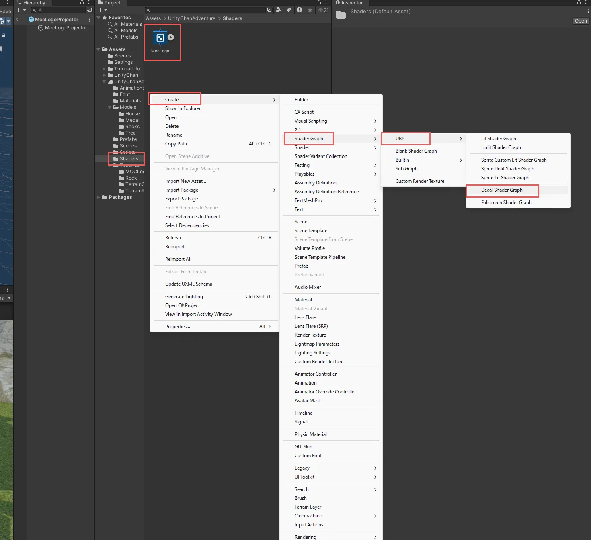

作成したら、 `MccLogo` を開いてください。はじめにプロパティを追加します。左上の `+` をクリックして、 `Texture2D` を追加してください。名前は `Main Texture` にしてください。

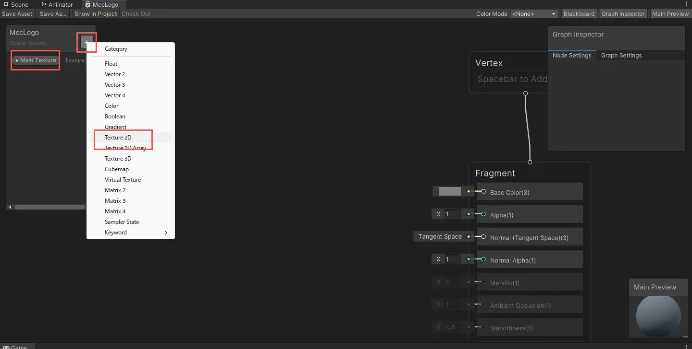

次に、右クリックして `Create Node` から Input -> Texture -> Sample Texture 2D ノードを追加してください。そして、  `Main Texture` プロパティをドラッグアンドドロップして配置し、 `Main Texture` プロパティの右の赤い部分を Sample Texture 2D の Texture(T2) の左の赤い部分にドラッグアンドドロップして接続してください。

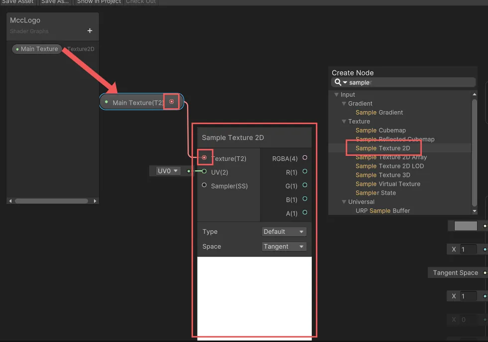

次に、 Sample Texture 2D の RGBA(4) の右のピンク色の部分を Fragment の Base Color(3) の左側の黄色の部分にドラッグアンドドロップして接続してください。また、 Sample Texture 2D の Alpha(1) の右の水色の部分を Fragment の Alpha(1) の左側の水色の部分にドラッグアンドドロップして接続してください。

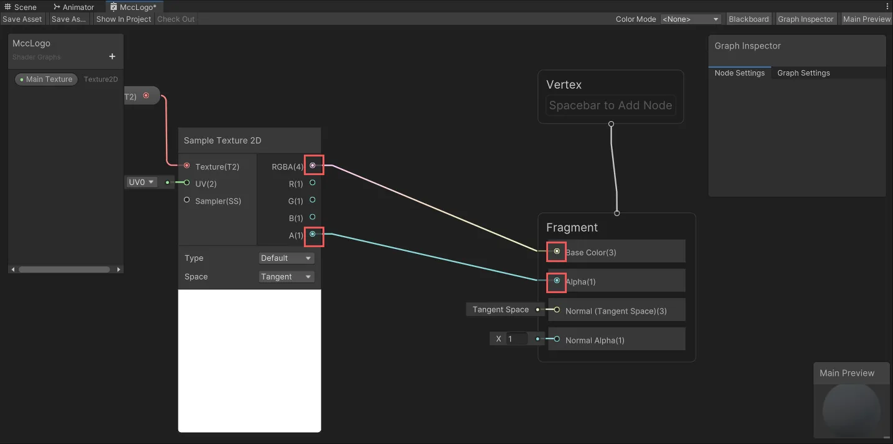

これで、 Decal のシェーダーグラフが完成しました。 `MccLogo` プレハブの `URP Decal Projector` の `Material` に `MccLogo` シェーダーの `▶` をクリックして出てくるマテリアルをドラッグアンドドロップしてください。

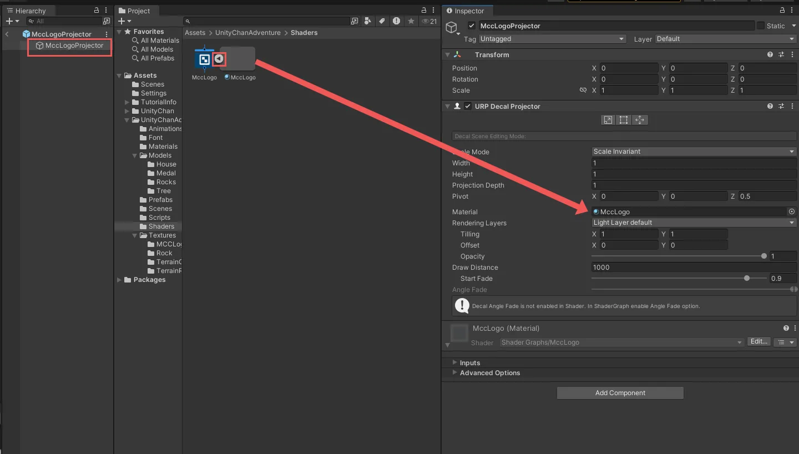

ShaderGraph で `Main Texture` を選択し、 `Other Inspector` の Defalt に /Assets/UnityChanAdventure/Textures/ の中にある `MCC_logo_1` をドラッグアンドドロップしてください。

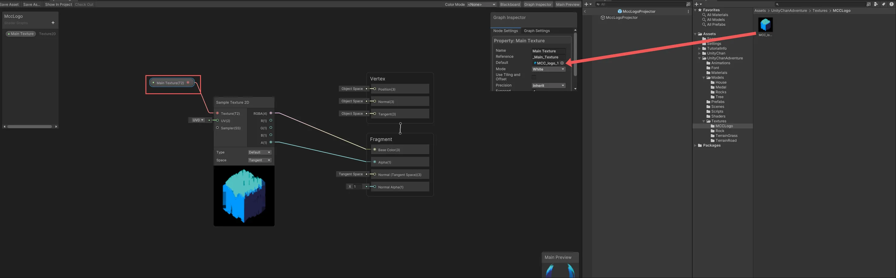

## 3.3. Decal の配置

`Stage` プレハブを開いて `MccLogoProjector` を配置してください。デカールはオブジェクトの Z 軸 (シーンビューで見ると青い矢印) の方向に投影されます。 `MccLogoProjector` の Transform の Rotation の X を 90 度にしてください。デカールは `URP Decal Projector` の `Width` と `Height` でサイズ、 `Projection Depth` で奥行きを調整できます。

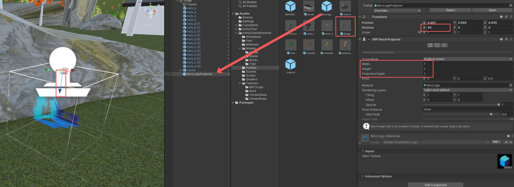

複数置いて様々な多きさ、場所で配置してみてください。建物や岩に投影するといい感じにできます。

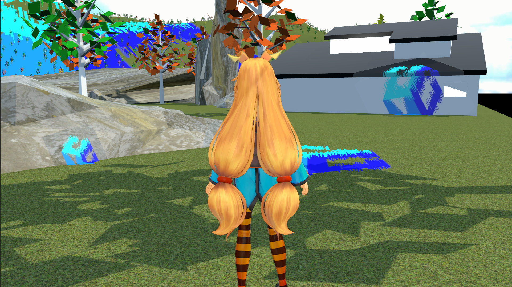

デカールのテクスチャを弾痕にして、動的に生成すれば、銃を撃って弾痕を残すことができます。

## 3.4. Decal の Rendeing Layer の設定

ここでは unity 2022.3.3f1 での設定方法を説明します。他のバージョンでは異なる場合があります。

このままでは、 Unity ちゃん自体にもデカールが投影されてしまいます。これを防ぐために、デカールのレイヤーを設定します。

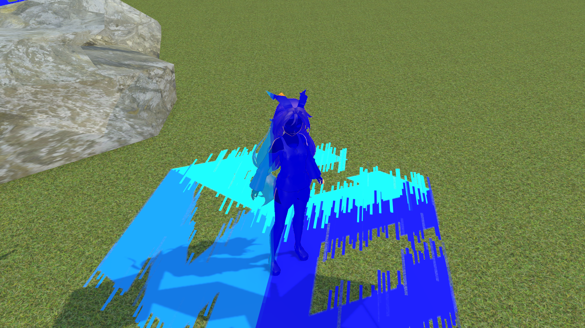

はじめに、 /Settings の中にある `URP-High Fidelity-Renderer (Universal Renderer Data)` を開いて、 `Decal` の中にある `Use Rendering Layers` にチェックを入れてください。

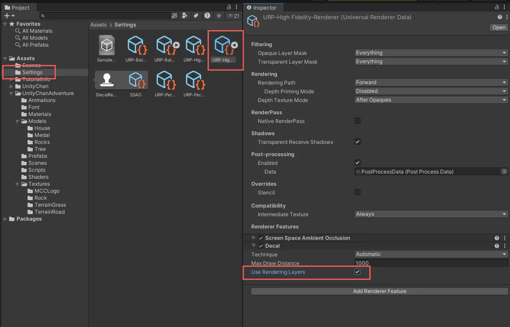

次に `Edit` -> `Project Settings` -> `Graphics` -> `URP Global Settings` を開いて、 `Rendering Layers (3D)` の `Leyer1` を `Decal Receivable` に変更してください。

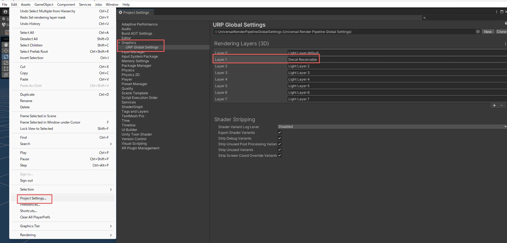

次に、すべてのオブジェクトにレンダリングレイヤーを設定します。はじめに岩を設定します。 /UnityChanAdventure/Prefabs/ の中にある岩を 4 つ選択して(Control押しながらクリックするとできる)、 Mesh Renderer コンポーネントの Additional Settings の `Rendering Layer Mask` をクリックして `Decal Receivable` をクリックしてチェックを入れてください。

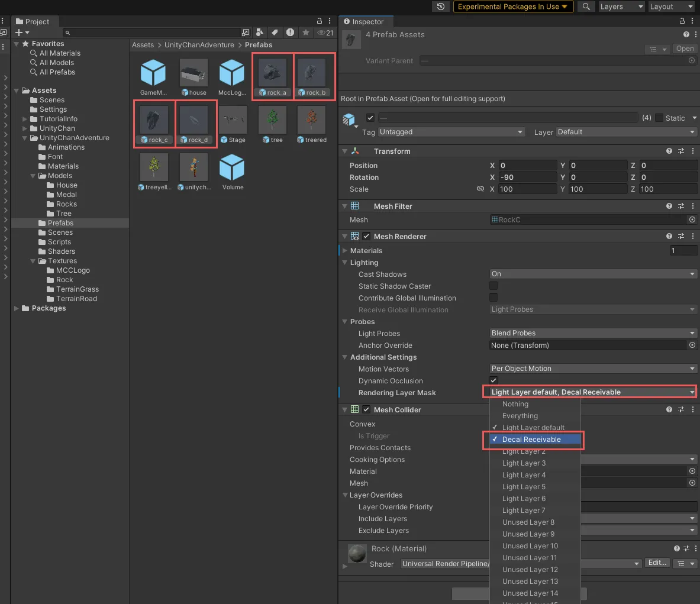

続いて家です。/UnityChanAdventure/Prefabs/ の中にある `House` プレハブを開いて、 以下の画像のように照明以外のオブジェクト(Pointがつくオブジェクト以外)を選択し、 Mesh Renderer コンポーネントの Additional Settings の `Rendering Layer Mask` をクリックして `Decal Receivable` をクリックしてチェックを入れてください。

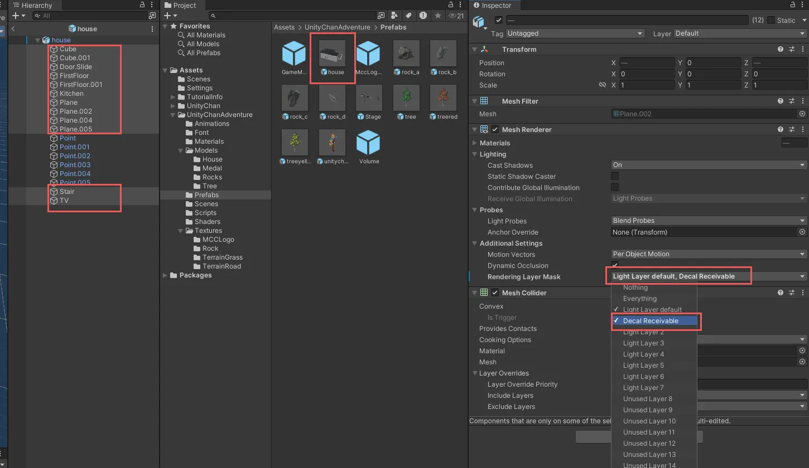

続いて Terrain です。/UnityChanAdventure/Prefabs/ の中にある `Stage` プレハブを開いて、 Terrain コンポーネントで `Terrain Settings` (5つの中で1番右のやつ) に切り替えて、Lighting の `Render Layer Mask` をクリックして `Decal Receivable` をクリックしてチェックを入れてください。

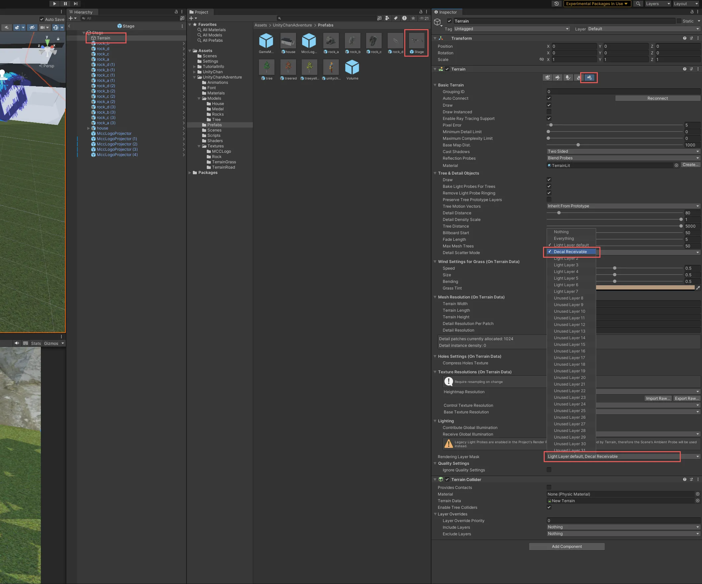

# 4. 依存性注入(DI) を使って スコア管理をする

ここでは、スコアのためにステージにスコア用のアイテムを置いて、 Unity ちゃんがアイテムに触れるとスコアが加算されるようにします。そしてスコアマネージャーがシーンを遷移しても参照できるように Zenject を使ってスコアマネージャーのインスタンスを管理します。

# 4.1.. 依存性注入(DI) とは

変数の代入は通常プログラムで `-` を使ったりして代入します。しかし、依存性注入(DI) は、変数の代入を自動で行うものです。これにより変数に代入する際、条件分岐して代入するものをその場の環境に合わせて自動で分岐して代入してくれたり、代入するオブジェクトがどこにあるかを気にせずに変数に代入させることができます。

Unity では、シーンを切り替えると、別のシーンにあったゲームオブジェクトを参照できなくなります。そこで、スコアマネージャーをシーン外で管理してもらって、シーン内でスコアマネージャーを参照したいときは、依存性注入(DI) を使ってスコアマネージャーのインスタンスを取得します。これによって、スコアマネージャーがシーン内にいなくても、依存性注入によって代入されるため、スコアマネージャーを参照することができます。

## 4.2. Zenject のインストール

Zenject は Unity Asset Store から Extenject Dependency Injection IOC をインストールすることで使用できます。 [ここ](https://assetstore.unity.com/packages/tools/utilities/extenject-dependency-injection-ioc-157735) からインストールしてください。まずは自身の Unity アカウントでログインし、マイアセットに追加してください。

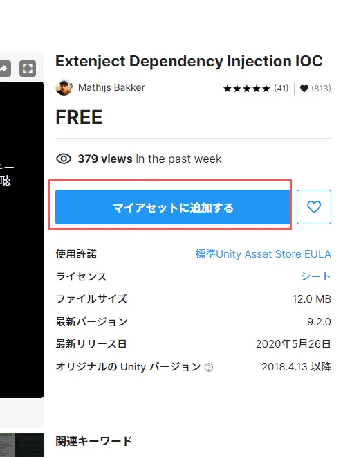

Unity エディタを開き、 Windo -> Package Manager から `Unity Registry` を `My Assets` に変更してください。そして、 `Extenject Dependency Injection IOC` をダウンロードしてください。ダウンロードできたら `Import` を押してインポートしてください。

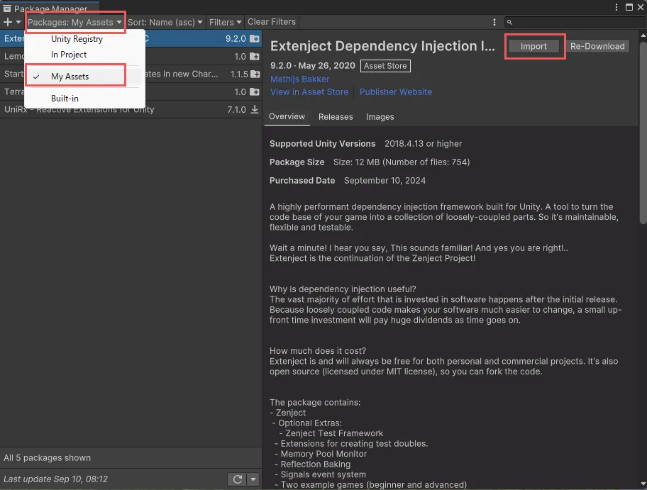

## 4.3. スコアマネージャーの作成

/UnityChanAdventure/Scripts/ の中に `IScoreManager.cs` を作成してください。

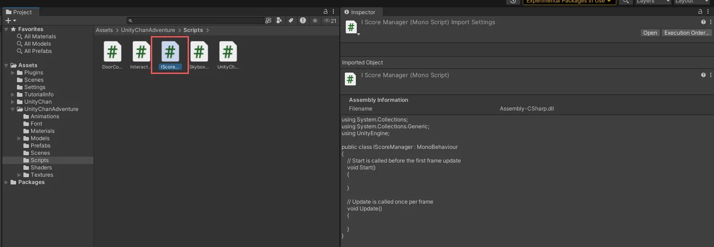

`IScoreManager.cs` の中身は以下の通りです。 `IScoreManager` インターフェースです。

```csharp title="IScoreManager.cs"
public interface IScoreManager
{
    void AddScore(ScoreItem scoreItem);
    int GetScore();
    void RegisterScoreItem(ScoreItem scoreItem);
}
```

/UnityChanAdventure/Scripts/ の中に `ScoreManagerImpl.cs` を作成してください。

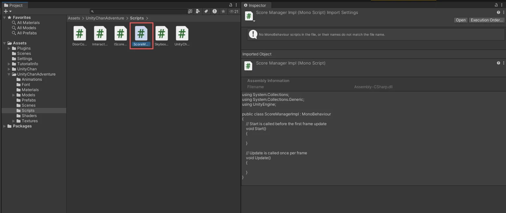

`ScoreManagerImpl.cs` の中身は以下の通りです。 `IScoreManager` インターフェースを実装したクラスです。

```csharp title="ScoreManagerImpl.cs"
using System.Collections.Generic;
using UnityEngine;

public class ScoreManagerImpl : IScoreManager
{
    private int score = 0;
    private List<ScoreItem> scoreItems = new List<ScoreItem>();

    public void AddScore(ScoreItem scoreItem)
    {
        score += scoreItem.GetScore();
        scoreItems.Remove(scoreItem);
        Debug.Log("Score: " + score);
    }

    public int GetScore()
    {
        return score;
    }

    public void RegisterScoreItem(ScoreItem scoreItem)
    {
        scoreItems.Add(scoreItem);
    }
}
```

## 4.4 スコアのアイテムの作成

/UnityChanAdventure/ModelssMedal の中にスコア用アイテムとして、 `medal` があります。これを右クリックして Create -> PrefabVariant を選択してください。そして、生成された `medal` プレハブを /UnityChanAdventure/Prefabs/ の中に移動してください。

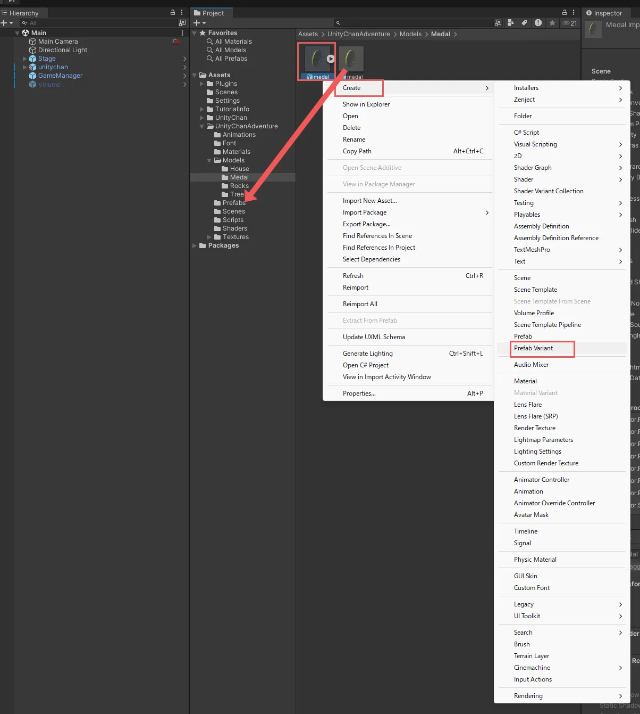

/UnityChanAdventure/Scripts/ の中に `ICollectable.cs` を作成してください。

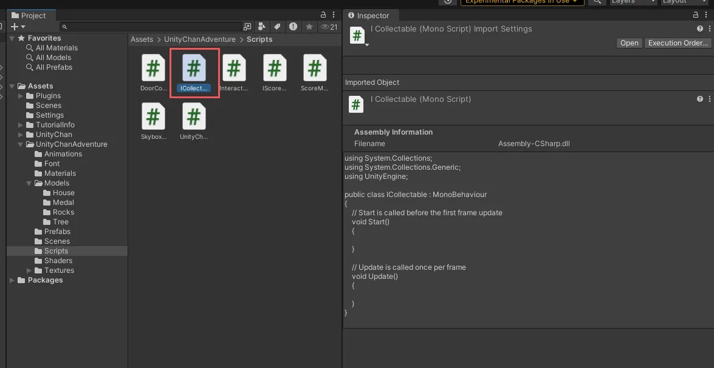

`ICollectable.cs` の中身は以下の通りです。 `ICollectable` インターフェースです。

```csharp title="ICollectable.cs"
public interface ICollectable
{
    void Collect();
}
```

UnityChanAdventure/Scripts/ の中に `ScoreItem.cs` を作成してください。

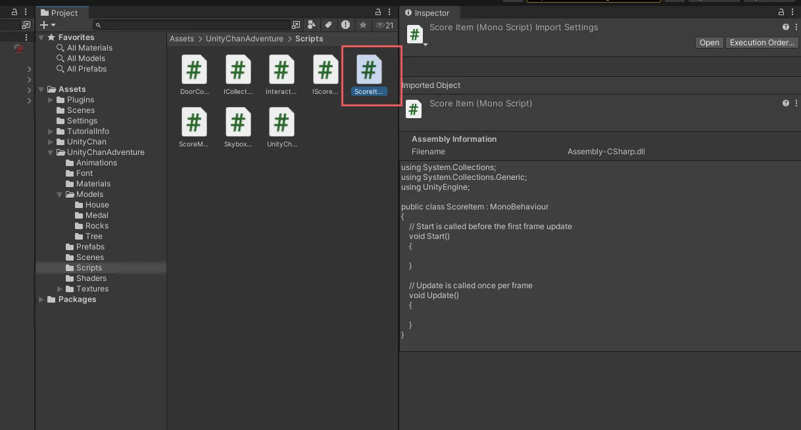

`ScoreItem.cs` の中身は以下の通りです。 `ICollectable` インターフェースを実装したクラスです。`[Inject]` で `IScoreManager` を注入しています。

```csharp title="ScoreItem.cs"
using System;
using UnityEngine;
using Zenject;

public class ScoreItem : MonoBehaviour, ICollectable
{
    [SerializeField] private int score = 10;

    [Inject] private IScoreManager scoreManager;

    private void Start()
    {
        scoreManager.RegisterScoreItem(this);
    }

    public void Collect()
    {
        scoreManager.AddScore(this);
        Destroy(gameObject);
    }
    
    public int GetScore()
    {
        return score;
    }
}
```

/UnityChanAdventure/Prefabs/ の中にある `medal` プレハブを開いて、 `ScoreItem` スクリプトドラッグアンドドロップして追加してください。

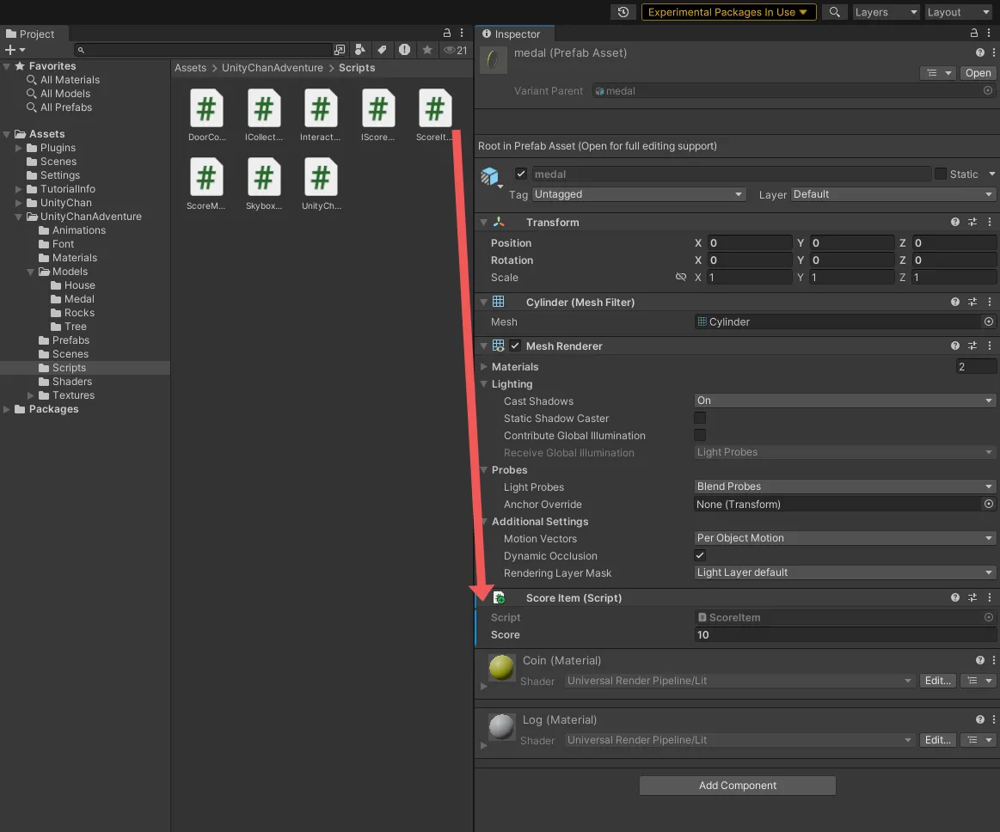

そして、 Add Component で `Box Collider` を追加してください。 `Is Trigger` にチェックを入れてください。そして、 `Scale` を小さくしてください。

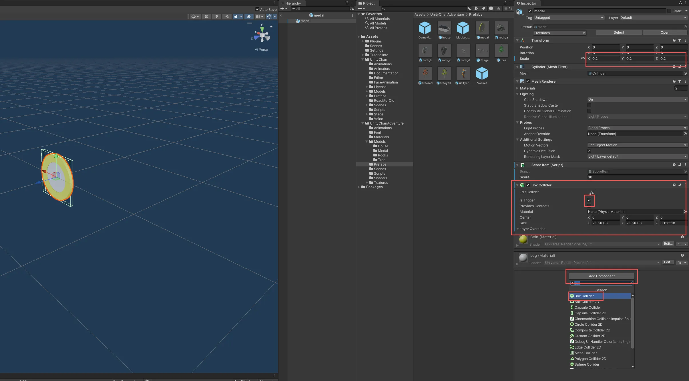

## 4.5. スコアマネージャーの注入の設定

/UnityChanAdventure/Scripts/ の中で右クリックし、 Create -> Zenject -> Installer を選択してください。そして、 `ScoreManagerInstaller.cs` という名前で作成してください。

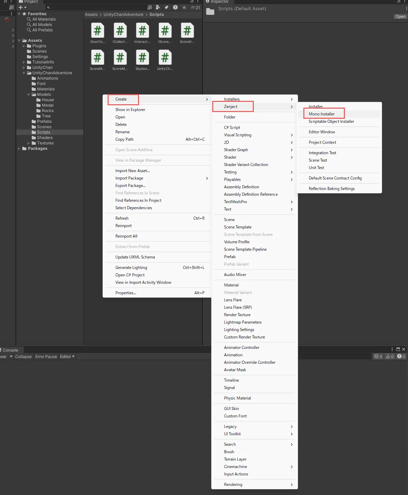

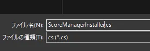

すると、インストーラーのスクリプトが生成されます。開いて、以下のように記述してください。

```csharp title="ScoreManagerInstaller.cs"
using UnityEngine;
using Zenject;

public class ScoreManagerInstaller : MonoInstaller
{
    public override void InstallBindings()
    {
        Container.Bind<IScoreManager>().To<ScoreManagerImpl>().AsSingle();
    }
}
```

`Main` シーンを開いて、 ヒエラルキー上で右クリックし、 Zenject -> Scene Context を選択してください。すると、シーン上に `SceneContext` が生成されます。

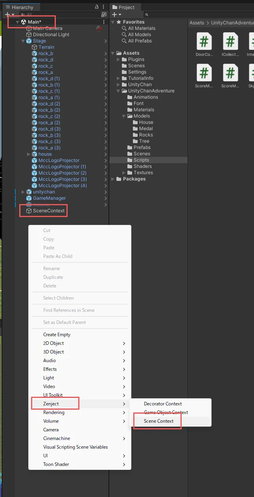

/UnityAdventure の Resources フォルダを作り、その中で右クリックして Create -> Zenject -> Project Context を選択してください。 `ProjectContext` が生成されます。

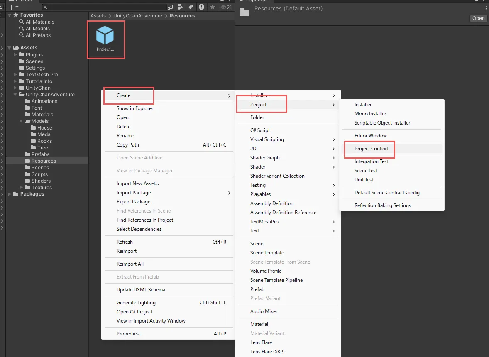

`ProjectContext` を選択して、 `ScoreManagerInstaller` をドラッグアンドドロップしてください。そして、 `ProjectContext` コンポーネントの `Mono Installers` の `+` を押して、`ScoreManagerInstaller` をドラッグアンドドロップして追加してください。

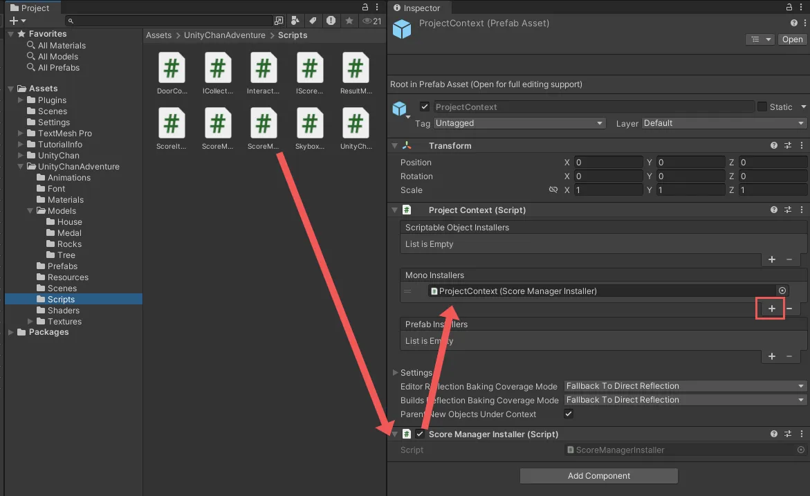

## 4.6. UNity ちゃんがアイテムに触れたらスコアが加算されるようにする

/UnityChanADventure/Scripts の中の `UnityChanController.cs` の OnTriggerEnter でアイテムに触れたら、 `ICollectable` インターフェースの `Collect` メソッドを呼び出します。これで、Unity ちゃんがアイテムに触れたら、スコアが加算されるようになります。

```diff title="UnityChanController.cs"
using System;
using System.Collections;
using System.Collections.Generic;
using UnityEngine;
using UnityEngine.InputSystem;

public class UnityChanController : MonoBehaviour
{
    private Rigidbody rb;
    private float speed;
    private float rotationSpeed;
    private Vector2 moveInput;
    private Animator animator;
    private Interactable interactableObj;

    [SerializeField] private float moveSpeedConst = 5.0f;
    [SerializeField] private float rotationSpeedConst = 5.0f;
    [SerializeField] private float jumpForce = 200.0f;
    [SerializeField] private float raydistance = 1.1f;

    void Start()
    {
        rb = GetComponent<Rigidbody>();
        animator = GetComponent<Animator>();
    }

    void FixedUpdate()
    {
        speed = moveInput.y * moveSpeedConst;
        rotationSpeed = moveInput.x * rotationSpeedConst;

        rb.velocity = transform.forward * speed + new Vector3(0f, rb.velocity.y, 0f);
        rb.angularVelocity = new Vector3(0, rotationSpeed, 0);
    }

    public void OnMove(InputAction.CallbackContext context)
    {
        moveInput = context.ReadValue<Vector2>();
        animator.SetFloat("speed", moveInput.y);
        animator.SetFloat("rotate", moveInput.x);
    }

    private void OnTriggerEnter(Collider other)
    {
        if (other.TryGetComponent<Interactable>(out var obj))
        {
            interactableObj = obj;
        }
        
+       if (other.TryGetComponent<ICollectable>(out var collectable))
+       {
+           collectable.Collect();
+       }
    }
    
    private void OnTriggerExit(Collider other)
    {
        if (other.gameObject.TryGetComponent<Interactable>(out var obj) && obj == interactableObj)
        {
            interactableObj = null;
        }
    }

    public void OnInteract(InputAction.CallbackContext context)
    {
        if (context.performed)
        {
            interactableObj?.Interact();
        }
    }
    
    public void OnJump(InputAction.CallbackContext context)
    {
        if (context.performed)
        {
            bool isGrounded = Physics.Raycast(transform.position + new Vector3(0.0f, 1.0f, 0.0f), Vector3.down, raydistance);
            if (isGrounded)
            {
                animator.SetTrigger("jump");
                rb.AddForce(Vector3.up * jumpForce);
            }
        }
    }
}
```

`Stage` プレハブに `Medal` を適当に配置してください。

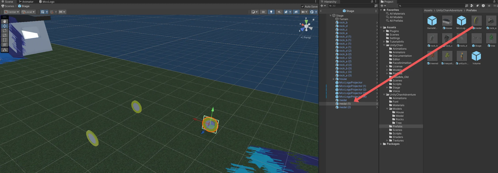

再生して、 Unity ちゃんがアイテムに触れると、スコアが加算されることを確認してください。デバッグでコンソールにスコアが表示されます。

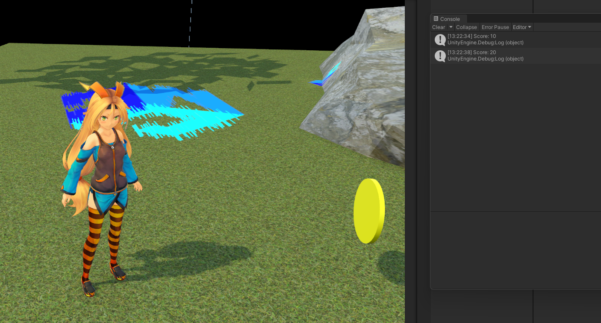

## 4.7. リザルトシーン

/UnityChanAdventure/Scenes/ の中に `Result` シーンを作成してください。そして、 `Result` シーンを開いてください。

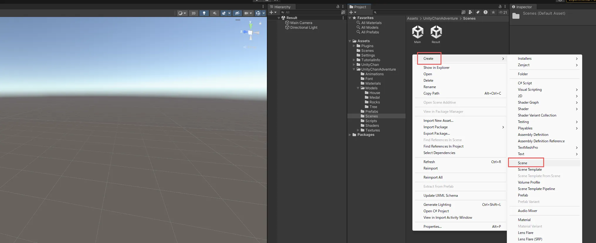

`Result` シーンに `Stage` プレハブを置いてください。これは背景として使います。カメラの位置と角度も適当な角度にしてください。

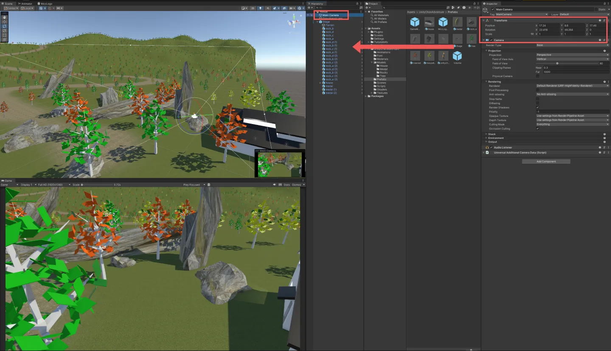

`Result` シーンで `Stage` のメダルは消してください。プレハブからは消さないでください。

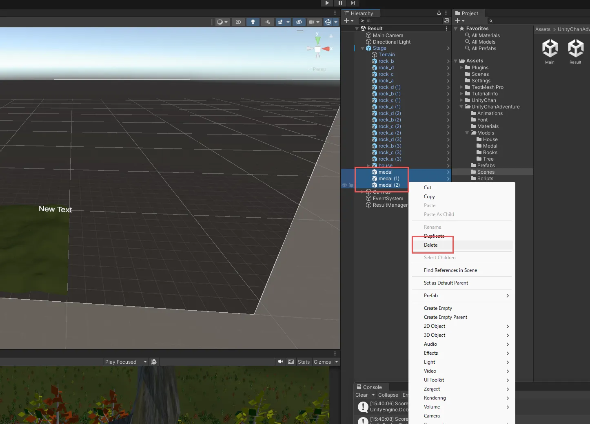

`Result` シーンのヒエラルキーで右クリックし、 UI -> Text - TextMeshPro を選択してください。これはスコアを表示するためのテキストです。テキストはCanvasの中に生成されます。TMP Importer が出てきたら Import してください。

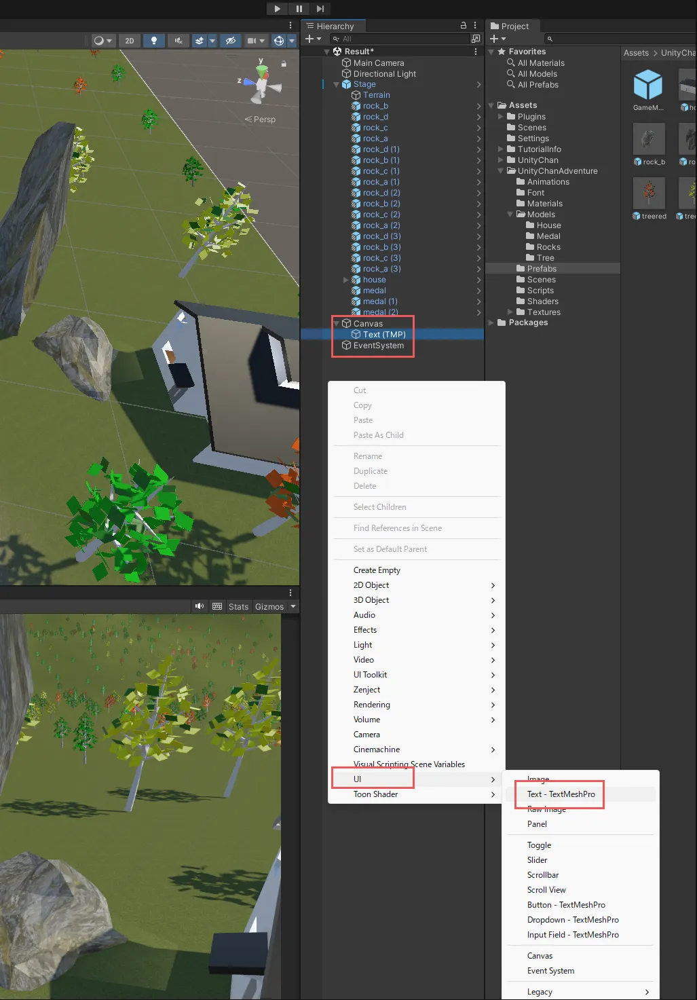

`Result` シーンのヒエラルキーで右クリックし、 UI -> Image を選択してください。これは Canvas の背景です。

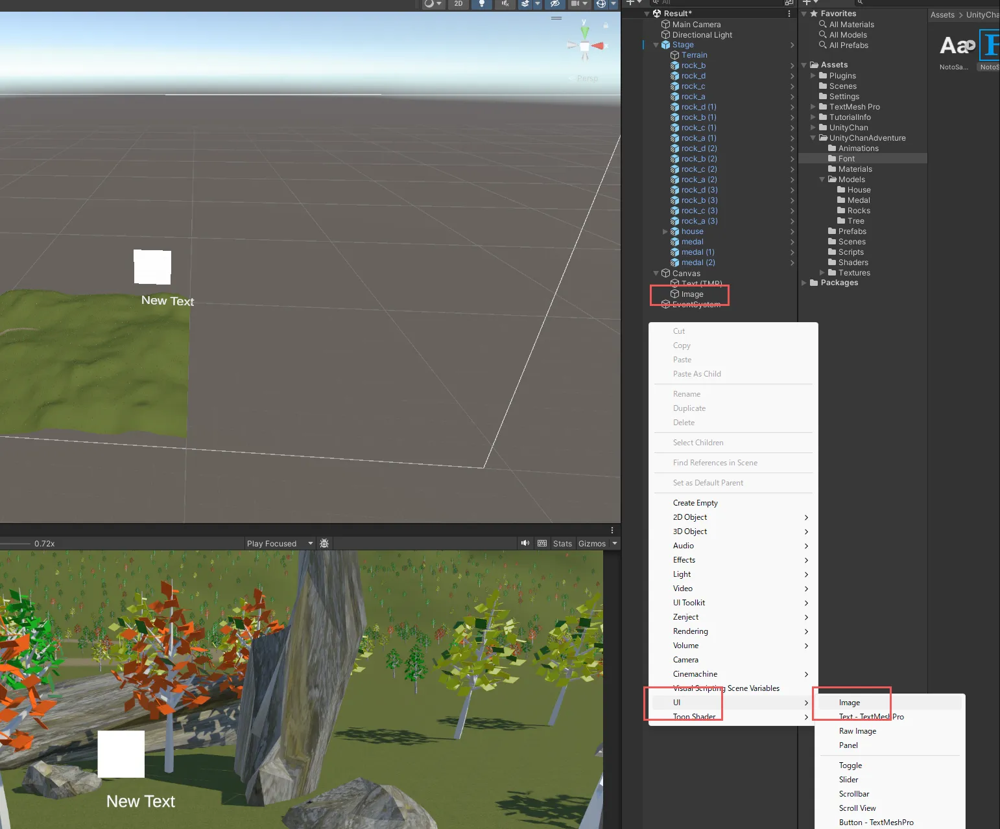

Image の色を暗い色にして、アルファ値(透明度)を下げるといい感じになります。

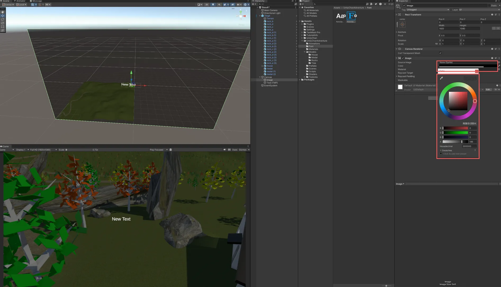

/UnityChanAdventure/Scripts/ の中に `ResultManager.cs` を作成してください。

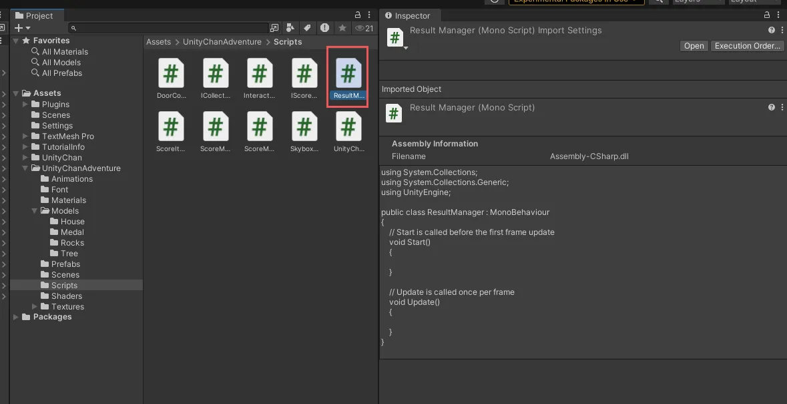

`Result` シーンのヒエラルキーで右クリックし、 Create Empty を選択して `ResultManager` オブジェクトを作ってください。そして、 `ResultManager` オブジェクトに `ResultManager` スクリプトをアタッチしてください。

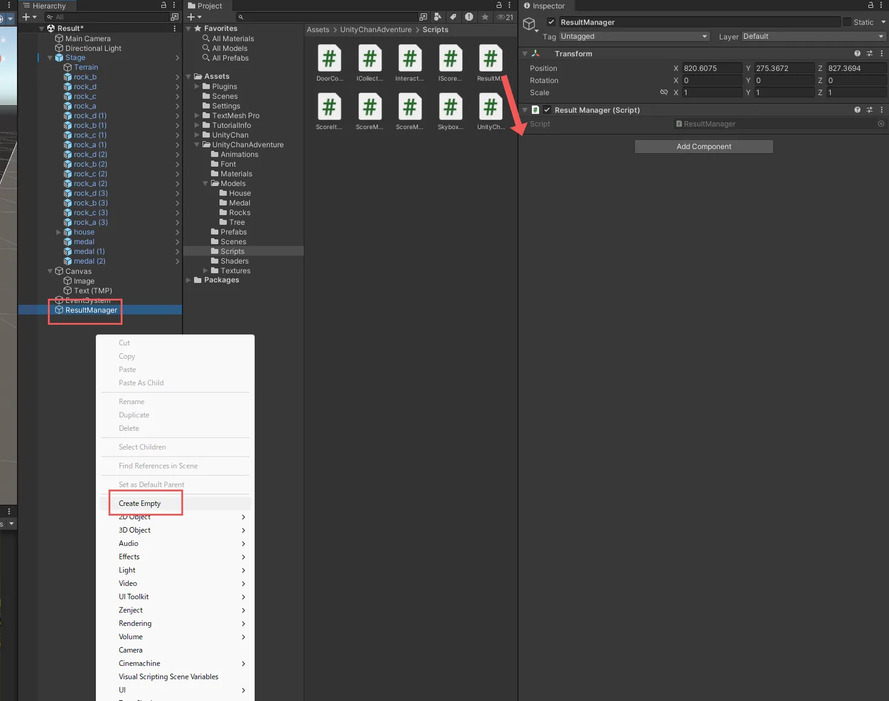

`ResultManager.cs` の中身は以下の通りです。 `IScoreManager` を注入して、スコアを取得してテキストに表示します。

```csharp title="ResultManager.cs"
using System.Collections;
using System.Collections.Generic;
using TMPro;
using UnityEngine;
using Zenject;

public class ResultManager : MonoBehaviour
{
    [SerializeField] private TextMeshProUGUI scoreText;
    
    [Inject] private IScoreManager scoreManager;
    
    private void Start()
    {
        scoreText.text = "Score: " + scoreManager.GetScore();
    }
}
```

`ResultManager` オブジェクトの `Resulr Manager` コンポーネントの `Score Text` に `Text (TMP)` をドラッグアンドドロップしてください。

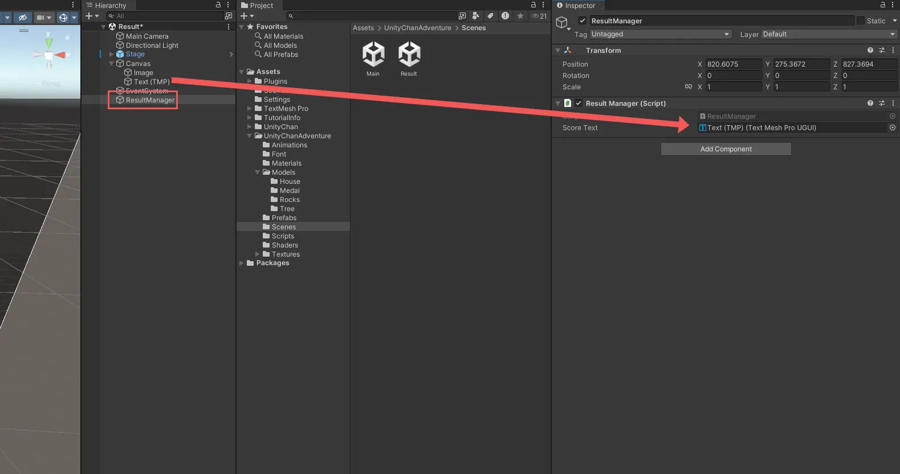

`Result` シーンを Build Setting に登録します。 File -> Build Settings を開いて、 `Add Open Scenes` を押してください。そうすれば、 `Result` シーンが登録されます。

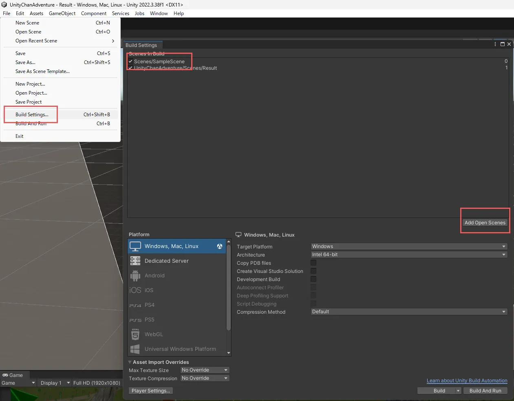

`Main` シーンを開いて、再生して確認してみましょう。


## 6. R3 で経過時間カウントをする。

R3 は Unity で Rx(Reactive Extensions) を行うためのライブラリです。 Rx はイベント駆動プログラミングを行うためライブラリです。

## 6.1. R3 のインストール

Unity で Rx を使うには、まず、 `NuGetForUnity` をプロジェクトに入れてから、 Nuget(.NETのパッケージマネージャー)経由で R3 のベースを入れて、その後、 `R3.Unity` を入れます。

Window -> Package Manager で Package Manager を開いて、 `+` を押して `Add package from git URL` を選択してください。そして以下の URL を入力して読み込んでください。

```
https://github.com/GlitchEnzo/NuGetForUnity.git?path=/src/NuGetForUnity
```

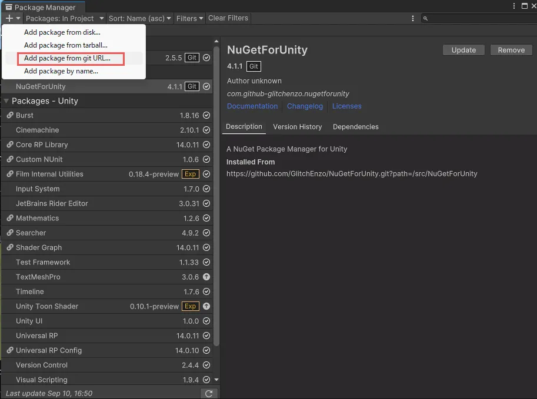

Nuget -> Manage NuGet Packages で NuGet パッケージを開いて、 `R3` を検索してください。 そして `R3` をインストールしてください。

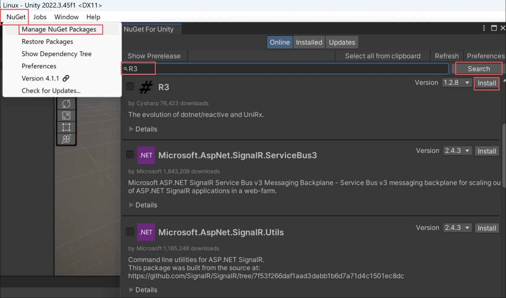

```
https://github.com/Cysharp/UniTask.git?path=src/UniTask/Assets/Plugins/UniTask  
```

## 6.2. テキストの作成

`Main` シーンで、 ヒエラルキーで右クリックして UI -> Text - TextMeshPro を選択してください。 名前は `TimeText` にします。これは経過時間を表示するためのテキストです。テキストは Canvas の中に生成されます。

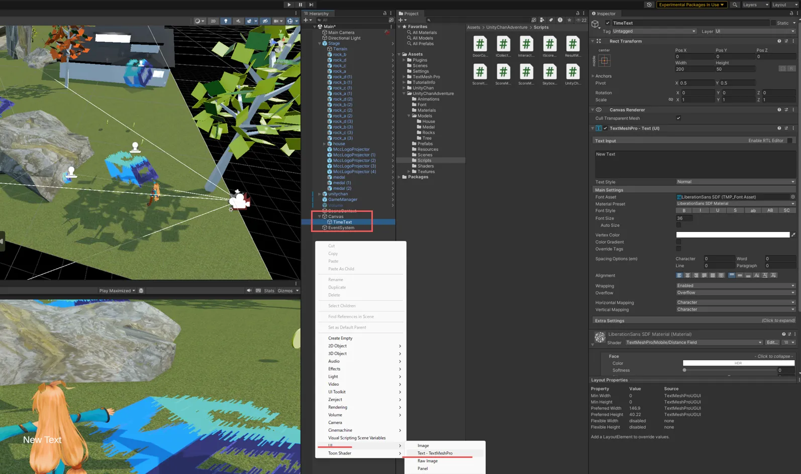

TimeText を Canvas の右上に移動させ、text を `0 秒経過` にしてください。すると、テキストがうまく表示されないのがわかります。

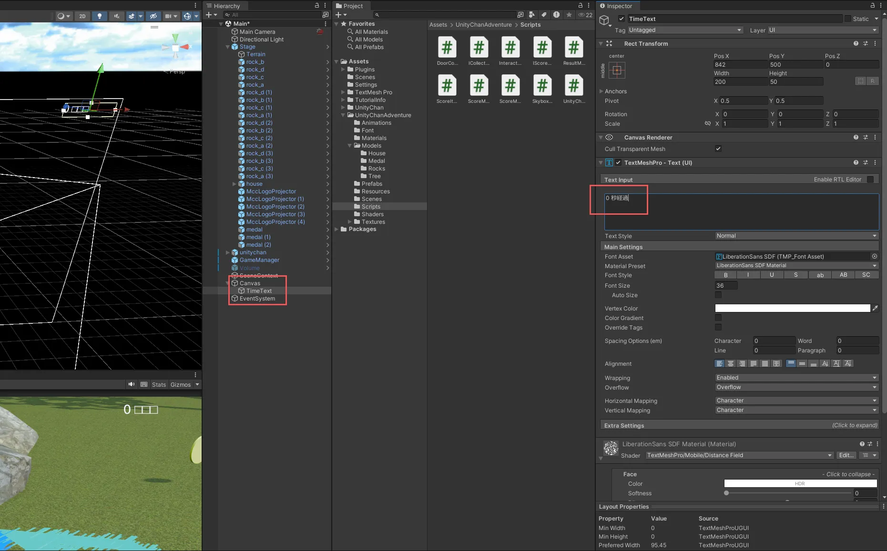

これは、使ってる Text Mesh Pro のアセットが日本語に対応していないからです。日本語に対応しているアセットは、 /UNityChanAdventure/Font の `NotoSansJP-VariableFont_wght SDF` です。 TimeText の Font Asset に `NotoSansJP-VariableFont_wght SDF` をドラッグアンドドロップしてください。そうすれば、日本語に対応しているので、テキストがうまく表示されます。

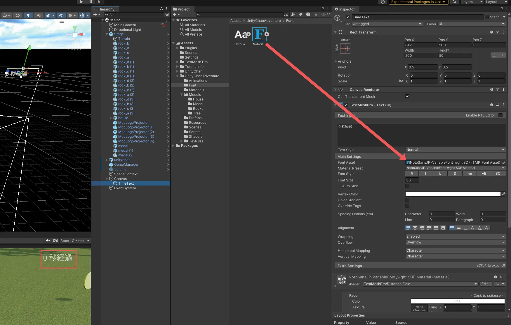

## 6.3. 経過時間のカウント

/UnityChanAdventure/Scripts/ の中に `TimeManager.cs` を作成してください。

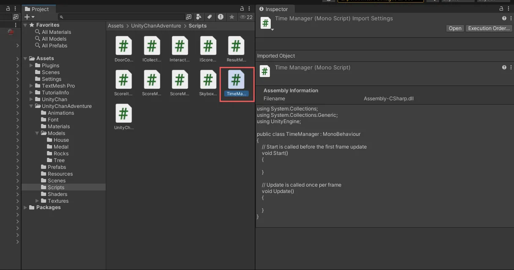

`TimeManager.cs` の中身は以下の通りです。 `UniTask` を使って経過時間をカウントします。


# MCC Unity講習会

* [環境構築編](https://tuatmcc.com/blog/UnityLec2024Step0/)
* [入門編](https://tuatmcc.com/blog/UnityLec2024Step1/)
* [応用編](https://tuatmcc.com/blog/UnityLec2024Step2/)
* 発展編 ← 今ここ
