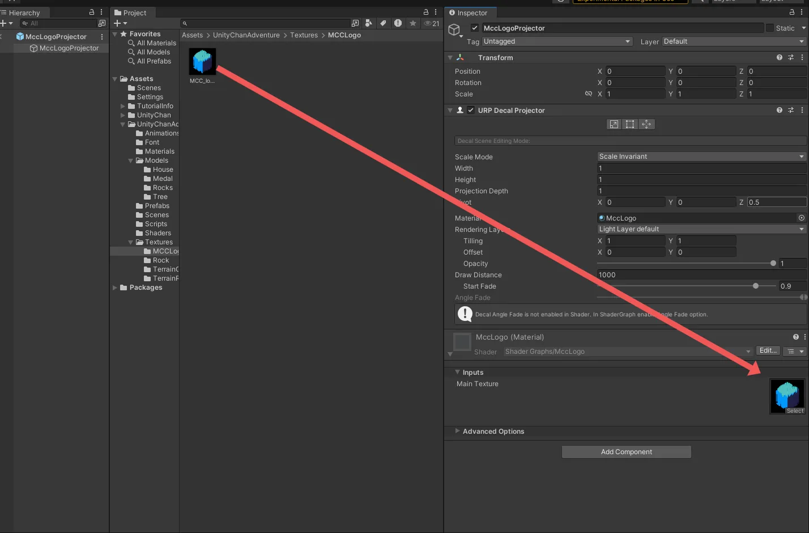

* [環境構築編](https://tuatmcc.com/blog/UnityLec2024Step0/)
* [入門編](https://tuatmcc.com/blog/UnityLec2024Step1/)
* [応用編](https://tuatmcc.com/blog/UnityLec2024Step2/)
* 発展編 ← 今ここ

# 1. はじめに

* この記事は Unity 講習会 2024 発展編の資料です
* Unity Hub と Unity 2022.3.38f1 をインストール済み(※ 2022.3.38f1 はあくまで例)
* 任意の IDE がある(Visual studio, Rider など)
* Unity ちょっと触ったことがある人

## 1.1. 題材

Unityちゃんアドベンチャーゲーム

## 1.2. 学ぶこと

* Decal
* Zenject
* UniTask, R3
* DoTween

# 2. Unity ちゃんにアニメーションを追加する

ここでは Unity ちゃんにジャンプのアニメーションを追加します。

## 2.1. ジャンプアニメーションの追加

/Assets/UnityChanAdventure/Animations/ の中にある `UnityChanAnimatorController` に /Assets/UnityChan の中にある `JUMP00B` をドラッグアンドドロップしてください。**`JUMP00` ではなく、`JUMP00B` です！**


次に、 `+` を押してパラメーターに `jump` を追加してください。種類は `Trigger` です。


続いて、ジャンプのアニメーションステートに `Move` と `Idle` から遷移する矢印を双方向に追加してください。


ジャンプのステートに向かう２つの矢印(`Idel -> Jump00B` と `Move -> Jump00`)では、 `Has Exit Time` のチェックを外してください。そして、 `Conditions` に `Jump` を追加してください。


`Jump00B -> Move` への `Conditions` には `speed` で `0.1` 以上を設定してください。


`Jump00B -> Idle` への `Conditions` には `speed` で `0.1` 未満を設定してください。


## 2.2. ジャンプをスペースキーで発動させる

スペースキーを押すとジャンプするようにします。

/Assets/UnitychanAdventure の中にある Input Actions Assets の `Main` に `+` を押して `Jump` を追加してください。キーの内容はスペースキーです。


設定できたら、 Input Action Assets の編集ウィンドウの上のほうにある `Save Asset` を押して保存してください。

次に /Assets/UnitychanAdventure/Scripts/UnityChanController.cs の中にある `Update` メソッドに以下のコードを追加してください。

```diff title="UnityChanController.cs"
using System;
using System.Collections;
using System.Collections.Generic;
using UnityEngine;
using UnityEngine.InputSystem;

public class UnityChanController : MonoBehaviour
{
    private Rigidbody rb;
    private float speed;
    private float rotationSpeed;
    private Vector2 moveInput;
    private Animator animator;
    private Interactable interactableObj;

    [SerializeField] private float moveSpeedConst = 5.0f;
    [SerializeField] private float rotationSpeedConst = 5.0f;

    void Start()
    {
        rb = GetComponent<Rigidbody>();
        animator = GetComponent<Animator>();
    }

    void FixedUpdate()
    {
        speed = moveInput.y * moveSpeedConst;
        rotationSpeed = moveInput.x * rotationSpeedConst;

        rb.velocity = transform.forward * speed + new Vector3(0f, rb.velocity.y, 0f);
        rb.angularVelocity = new Vector3(0, rotationSpeed, 0);
    }

    public void OnMove(InputAction.CallbackContext context)
    {
        moveInput = context.ReadValue<Vector2>();
        animator.SetFloat("speed", moveInput.y);
        animator.SetFloat("rotate", moveInput.x);
    }

    private void OnTriggerEnter(Collider other)
    {
        if (other.TryGetComponent<Interactable>(out var obj))
        {
            interactableObj = obj;
        }
    }
    
    private void OnTriggerExit(Collider other)
    {
        if (other.gameObject.TryGetComponent<Interactable>(out var obj) && obj == interactableObj)
        {
            interactableObj = null;
        }
    }

    public void OnInteract(InputAction.CallbackContext context)
    {
        if (context.performed)
        {
            interactableObj?.Interact();
        }
    }

+   public void OnJump(InputAction.CallbackContext context)
+    {
+      if (context.performed)
+       {
+           animator.SetTrigger("jump");
+       }
+   }
}
```

`Main` シーンを開き、Hierarchy にある `GameManeger` の `Player Input` の `Event` -> `Main` の `Jump` で `+` を押し、 `Main` シーンにある `unitychan` をドラッグアンドドロップして、 No Function のところにある `Unity Chan Controller` の `On Jump` を選択してください。


# 2.3. ジャンプの修正

一見問題なくジャンプできそうですが、ジャンプすると両足が揃ってるときに、滑って見えます。また、スペースキーを連打すると、連続でジャンプしてしまいます。


滑って見える問題は、アニメーションの遷移する時間を長くすることで多少解決できます。 UnityChanAnimatorController で、ジャンプのステートと、移動のステートの遷移を開き、タイムバーにある `>|`, `|<` をドラッグして長くしてください。長さはジャンプのアニメーションの半分ぐらいに合わせてください。逆向きの遷移も同様にしてください。


これで、ジャンプのアニメーションが多少滑らかになりました。


連続ジャンプは、地面の接地判定をし、空中にいる間ジャンプを無効化することで解決できます。しかし、現状のUnityちゃんではジャンプしても当たり判定は変わっていません。つまり、見た目はジャンプしても物理演算的には常に地面にいるので、空中判定がとれません。以下では緑の枠が当たり判定で、ジャンプしても、当たり判定が地面にあることがわかります。


ジャンプしたらUnityちゃんに上方向の力を加えます。空中判定は Raycast で行います。Raycast は、指定した方向に線を飛ばし、当たったオブジェクトを取得することができます。

/Assets/UnitychanAdventure/Scripts/UnityChanController.cs に以下のコードを追加してください。

```diff title="UnityChanController.cs"
using System;
using System.Collections;
using System.Collections.Generic;
using UnityEngine;
using UnityEngine.InputSystem;

public class UnityChanController : MonoBehaviour
{
    private Rigidbody rb;
    private float speed;
    private float rotationSpeed;
    private Vector2 moveInput;
    private Animator animator;
    private Interactable interactableObj;
    
    [SerializeField] private float moveSpeedConst = 5.0f;
    [SerializeField] private float rotationSpeedConst = 5.0f;
+   [SerializeField] private float jumpForce = 200.0f;
+   [SerializeField] private float raydistance = 1.1f;

    void Start()
    {
        rb = GetComponent<Rigidbody>();
        animator = GetComponent<Animator>();
    }

    void FixedUpdate()
    {
        speed = moveInput.y * moveSpeedConst;
        rotationSpeed = moveInput.x * rotationSpeedConst;

        rb.velocity = transform.forward * speed + new Vector3(0f, rb.velocity.y, 0f);
        rb.angularVelocity = new Vector3(0, rotationSpeed, 0);
    }

    public void OnMove(InputAction.CallbackContext context)
    {
        moveInput = context.ReadValue<Vector2>();
        animator.SetFloat("speed", moveInput.y);
        animator.SetFloat("rotate", moveInput.x);
    }

    private void OnTriggerEnter(Collider other)
    {
        if (other.TryGetComponent<Interactable>(out var obj))
        {
            interactableObj = obj;
        }
    }

    private void OnTriggerExit(Collider other)
    {
        if (other.gameObject.TryGetComponent<Interactable>(out var obj) && obj == interactableObj)
        {
            interactableObj = null;
        }
    }

    public void OnInteract(InputAction.CallbackContext context)
    {
        if (context.performed)
        {
            interactableObj?.Interact();
        }
    }

    public void OnJump(InputAction.CallbackContext context)
    {
        if (context.performed)
        {
+           bool isGrounded = Physics.Raycast(transform.position + new Vector3(0.0f, 1.0f, 0.0f), Vector3.down, raydistance);
+           if (isGrounded)
+           {
+               animator.SetTrigger("jump");
+               rb.AddForce(Vector3.up * jumpForce);
+           }
        }
    }
}
```

これで、ジャンプしても空中にいるかどうかが判定され、空中にいる場合はジャンプできなくなります。また、ジャンプ時に上方向に力が加わるので、ジャンプで当たり判定も変わります。


# 3. Decal

Decal はプロジェクターで投影するように、任意の画像や動画を投影するものです。ここでは Unity 標準の Decal を使って、 MCC のロゴを投影します。

## 3.1. Decal の追加

/UnityChanAdventure/Prefabs/ の中に `MccLogoProjector` プレハブを作成してください。その後、 `MccLogoProjector` に `URP Decal Projector` コンポーネントを追加してください。


`URP Decal Projector` コンポーネントに "The current renderer has no Decal Renderer Feature added." という警告が出てきます。その隣の `Open` をクリックし、Universal Render Data を開き、`Add Renderer Feature` をクリックして、 `Decal` を追加してください。


これで `MccLogoProjector` に警告が出なくなります。


## 3.2. Decal マテリアルの作成

Decal のマテリアルを作るために、 Decal のシェーダーを作ります。

/Assets/UnityChanAdventure で右クリックし、 `Shaders` フォルダーを作り、 `Shaders` フォルダーの中で右クリックし。 Create -> Shader Graph -> URP -> Decal Shader Graph を選択して、 `MccLogo` という名前のシェーダーグラフを作成してください。


作成したら、 `MccLogo` を開いてください。はじめにプロパティを追加します。左上の `+` をクリックして、 `Texture2D` を追加してください。名前は `Main Texture` にしてください。


次に、右クリックして `Create Node` から Input -> Texture -> Sample Texture 2D ノードを追加してください。そして、  `Main Texture` プロパティをドラッグアンドドロップして配置し、 `Main Texture` プロパティの右の赤い部分を Sample Texture 2D の Texture(T2) の左の赤い部分にドラッグアンドドロップして接続してください。


次に、 Sample Texture 2D の RGBA(4) の右のピンク色の部分を Fragment の Base Color(3) の左側の黄色の部分にドラッグアンドドロップして接続してください。また、 Sample Texture 2D の Alpha(1) の右の水色の部分を Fragment の Alpha(1) の左側の水色の部分にドラッグアンドドロップして接続してください。


これで、 Decal のシェーダーグラフが完成しました。 `MccLogo` プレハブの `URP Decal Projector` の `Material` に `MccLogo` シェーダーの `▶` をクリックして出てくるマテリアルをドラッグアンドドロップしてください。


MccLogoProjector のマテリアルの Inputs にある `Main Texture` に /Assets/UnityChanAdventure/Textures/ の中にある `MCC_logo_1` をドラッグアンドドロップしてください。



## 3.3. Decal の配置

`Stage` プレハブを開いて `MccLogoProjector` を配置してください。デカールはオブジェクトの Z 軸 (シーンビューで見ると青い矢印) の方向に投影されます。 `MccLogoProjector` の Transform の Rotation の X を 90 度にしてください。デカールは `URP Decal Projector` の `Width` と `Height` でサイズ、 `Projection Depth` で奥行きを調整できます。


複数置いて様々な多きさ、場所で配置してみてください。建物や岩に投影するといい感じにできます。


デカールのテクスチャを弾痕にして、動的に生成すれば、銃を撃って弾痕を残すことができます。

# MCC Unity講習会

* [環境構築編](https://tuatmcc.com/blog/UnityLec2024Step0/)
* [入門編](https://tuatmcc.com/blog/UnityLec2024Step1/)
* [応用編](https://tuatmcc.com/blog/UnityLec2024Step2/)
* 発展編 ← 今ここ
